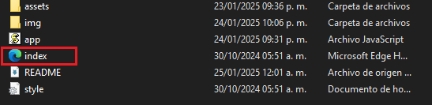
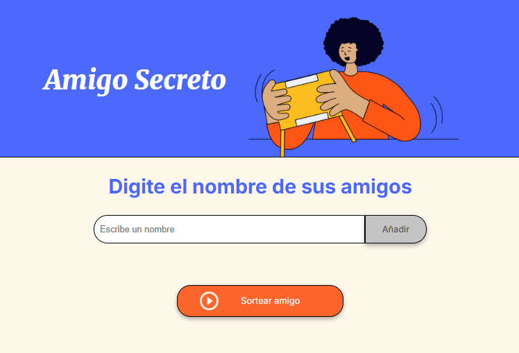
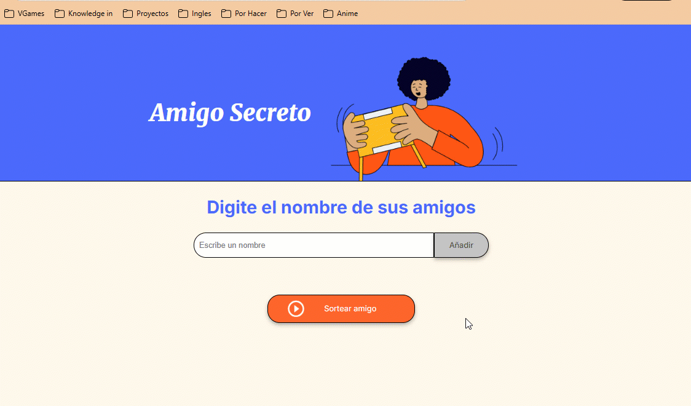

 

  
  
  
  <h1>Challenge: Amigo Secreto</h1>

  

    🤯Un increíble proyecto donde podrás ingresar una lista de nombres de amigos y poder sortear al amigo secreto🥳.
   
  

---

  
Indice

- [🤔Acerca del proyecto](#acerca-del-proyecto)
- [👷‍♂️Construido con:](#️construido-con)
- [🛠Cómo empezar.](#cómo-empezar)
  - [📜Pre-requisitos](#pre-requisitos)
  - [💻Iniciar el minijuego](#iniciar-el-minijuego)
- [🛶Funcionamiento](#funcionamiento)
  - [🚓Evaluaciones y Restricciones](#evaluaciones-y-restricciones)
- [Roadmap](#roadmap)

---

## 🤔Acerca del proyecto

En el actual proyecto haremos uso de los conocimientos aprendidos en el curso de **Lógica de Programación** impartido por **ALURA Latam** - **ONE** (Oracle Next Education).

Mediante el uso de variables, funciones, arreglos y entre otras, se creara un minijuego llamado Amigo Secreto, el cual consiste en ir ingresando nombres de amigos de los cuales se sorteara uno de ellos de manera aleatoria.
Hay que tener en cuenta que se necesitaran algunas restricciones y validaciones, como lo es:

- No ingresar nombres vacíos
- No sortear si no sean ingresado nombres

---

## 👷‍♂️Construido con:

Su construcción fue mediante las siguientes herramientas:

![HTML][HTML]
![CSS][CSS]
![JavaScript][JavaScript]
![Git][Git]
![GitHub][GitHub]

<!-- GETTING STARTED -->

## 🛠Cómo empezar.

Para hacer uso del minijuego **Amigo Secreto** solo se tiene que descargar este repositorio. 🙌

### 📜Pre-requisitos

Hay varias maneras de desplegar el minijuego, pero la mas util es tener un explorador instalado en tu computadora o celular ya sea: 

- Google Chrome
- Mozilla Firefox
- Edge

### 💻Iniciar el minijuego

Una vez descargado el repositorio y tener listos los archivos, solo se necesita abrir el archivo `index.html` con el navegador de tu preferencia.

Se abrirá una nueva pestaña en el buscador y se podrá iniciar el minijuego.

## 🛶Funcionamiento 

1. Se necesita ir añadiendo los nombres de amigos, para lo cual en el cuadro de entrada se escribe el nombre y una vez listo, se da click en añadir
2. Se observara que se imprime el nombre añadido
3. Como se vallan agregando nombres, estos mismos aparecerán en pantalla.
4. Una vez ingresados todos los nombres requeridos, se esta preparado para sortear y descubrir el amigo secreto.
5. Al dar click en `Sortear amigo`, se imprimirá en pantalla el nombre del amigo que fue tomado de manera aleatoria y quien es el **amigo secreto**.
   
### 🚓Evaluaciones y Restricciones
- En caso de que no se escriba nada en el recuadro de entrada y se da clic en `añadir`, se arrojara una alerta por entrada vacía.
- Ahora si se da click en `Sortear amigo` sin haber ingresado un nombre, igualmente arrojara una alerta y no permitirá el sorteo.
- 
## Roadmap
En esta primera version, se logro el objetivos del sorteo, pero aun se podría mejorar agregando mas características haciendo mas util y entretenido el juego.

- [X] Añadir amigos
- [X] Sorteo de amigo
- [ ] Agregar restriccion de nombres repetidos
- [ ] Sortear todos los nombres agregados
- [ ] Eliminar los nombres ya sorteados de la lista
- [ ] Reinicio del juego mediante un botón u otra forma.

<a href="#readme-top">regresar al inicio</a>

<!-- MARKDOWN LINKS & IMAGES -->
<!-- https://www.markdownguide.org/basic-syntax/#reference-style-links -->

[HTML]:https://img.shields.io/badge/HTML-%23E34F26.svg?logo=html5&logoColor=white
[CSS]:https://img.shields.io/badge/CSS-1572B6?logo=css3&logoColor=fff
[JavaScript]:https://img.shields.io/badge/JavaScript-F7DF1E?logo=javascript&logoColor=000
[Git]:https://img.shields.io/badge/Git-F05032?logo=git&logoColor=fff
[GitHub]:https://img.shields.io/badge/GitHub-%23121011.svg?logo=github&logoColor=white
